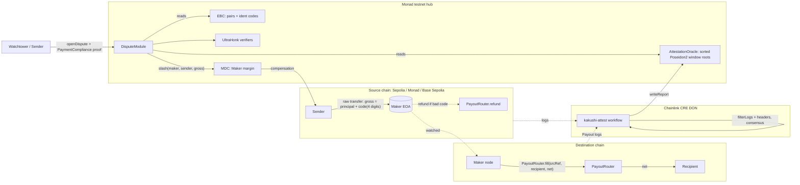

# Kakushi: execution plan

> Build checkpoint (2026-10-08): implementation gates and the current fork demonstration are tracked in [SUBMISSION.md](SUBMISSION.md); external sponsor limits in [docs/SPONSOR-GAP.md](docs/SPONSOR-GAP.md). Historical task statuses below are preserved.

> **Kakushi** (隠し) is a trust-minimized instant bridge. The user pays a Maker's wallet directly. The Maker pays the user on the destination chain in under a second to a few seconds. If the Maker cheats or goes offline, a zero-knowledge proof slashes the Maker's locked margin back to the user. Arbitration lives on **Monad**.
>
> Built for **Monad Metropolis**, Track 4 (Trust, Identity & AI Infrastructure). Bounties: Chainlink CRE, Privy, Envio, Cleanverse.
>
> Written 2026-10-08 from a grilling session with the project owner. This file is the single source of truth. A builder agent must be able to execute it with no other context.

---

## 1. Executive summary

- **What:** an Orbiter-Finance-style bridge, an independent implementation of Orbiter's *public* design (no Orbiter code is copied).
  - The Sender sends a raw transfer to a Maker's EOA, with a 4-digit destination code in the last 4 digits of the amount.
  - The Maker fills from their own destination inventory, through an event-emitting `PayoutRouter`.
  - Safety does not come from trusting the Maker. It comes from three things:
    - **margin** locked in the `MDC` on the Monad hub;
    - **Chainlink CRE**, which attests source payments and the full set of destination payouts per block window;
    - a **Noir ZK proof** (`PaymentCompliance`) showing that a valid source payment exists and that no compliant payout happened before the deadline. That proof slashes the margin to the Sender.
- **Where:**
  - USDC moves Sepolia ↔ Monad testnet (both directions).
  - Native ETH moves Sepolia ↔ Base Sepolia.
  - Every dispute settles on the **Monad testnet hub** (~600 ms finality).
- **Status today:** the repo is **empty**; every task is `[NOT STARTED]`. Completion is 0%.
- **Deadline:** **Tue 2026-10-13 23:59 ET** (2026-10-14 03:59 UTC). The internal submit target is **2026-10-13 20:00 ET**. There are about 5.5 working days, solo, with Claude agents in parallel.
- **Critical path:** freeze the spec → contracts → circuits + verifier → CRE attester → Maker/Watchtower → local three-scenario demo → testnet deploy (needs the user's "go" and funding) → video → submit.

---

## 2. Vision, problem, target users

**Problem.** Most bridges hold user funds in one lock-and-mint vault: one honeypot, a wrapped IOU on the other side, and slow, multisig-trusted releases. Fast "intent" bridges (Orbiter, Across) remove the vault, but the user still trusts the liquidity provider or an optimistic oracle. Users can't tell what protects them.

**Vision.** Make the safety mechanism *visible and provable*:
- every transfer shows the margin backing it and the attestation that covers it;
- if anything goes wrong, a one-click (or zero-click, via the Watchtower) proof gets the money back.

"Hidden" (隠し): the safety machinery stays out of sight on the happy path and is fully inspectable when you need it.

**Target users**
1. **Senders:** crypto-native users moving USDC/ETH between Sepolia, Base Sepolia and Monad. They want speed and want to avoid wrapped assets.
2. **Makers:** liquidity providers who hold inventory on several chains, earn fees, and post margin.
3. **Challengers/Watchtowers:** permissionless services that earn a reward by disputing missed fills.
4. **Dealers:** third-party frontends or relayers that route Senders to Makers (P2).
5. **Judges** (the immediate audience): they must understand the claim in 60 s and see it proven live in 3 minutes.

**Value proposition:** "Bridge to Monad in seconds, with your money backed by slashable margin and a ZK proof instead of a promise."

---

## 3. Goals and definitions of done

### 3.1 Winning goals (Metropolis)
- **Main track T4 scoring** (each 20%): product quality, technical excellence, Monad integration, track fit, innovation.
- **Bounty scoring:** meeting the stated requirement 40%, technical implementation 30%, Monad integration 20%, innovation 10%.
- **Bounties targeted:**

  | Bounty | Prize | Kakushi integration |
  |---|---|---|
  | Chainlink CRE | $3k | The CRE workflow *is* the attestation layer |
  | Privy | $5k | Monad gas sponsorship for disputes, plus the Maker's server wallet with policy |
  | Envio | $1k + hosting | Multichain indexer with derived Maker reliability |
  | Cleanverse | $2k, T4 | Compliant aUSDC lane |

### 3.2 Product Done
- A Sender can quote, send and receive on all 4 USDC/ETH routes. They see status from "source seen" through "payout final", with real per-chain timings.
- A Sender whose Maker fails gets made whole from margin. This happens automatically (Watchtower) or manually (UI dispute with an in-browser proof).
- A typo'd code creates an enforced refund. No loss.
- A Maker can register pairs, deposit and withdraw margin (timelocked), see exposure and inventory, and pause pairs.
- Anyone can see each Maker's margin, reliability and fill latency, and each chain's attestation coverage.

### 3.3 Technical Done
- All contracts deployed on Monad testnet (hub and routers), Sepolia and Base Sepolia (routers), and verified (Sourcify/MonadVision; Etherscan and Basescan).
- Every security invariant in §11.2 has a passing Foundry test, plus a fuzz test that Solidity and Noir fee math agree on 1,000 cases.
- `PaymentCompliance` and `PayoutInclusion` circuits are compiled. Their checked-in Solidity verifiers are regenerated in CI and diffed.
- The CRE workflows compile, `cre workflow simulate --broadcast` writes real reports to the hub, and the oracle enforces window contiguity.
- Two Maker nodes, the Watchtower, the SDK, the EVM adapter, the Solana adapter stub and the app all pass typecheck, lint and tests.
- CI is green on GitHub Actions. No secrets are tracked.

### 3.4 Demo Done
- `pnpm demo` boots 3 anvils plus every service from clean and runs scenarios A, B and C (§13.2). It prints a PASS receipt for each in under 3 minutes.
- `forge script script/Demo.s.sol` runs a contracts-only version of A/B/C across the 3 local chains.
- A ≤ 3-minute video recorded on real testnets (fallback: a local-fork video, clearly labelled as such).

### 3.5 Hackathon Done
- Submitted from a spare teammate's account in T4 before the deadline.
- Public repo `nickthelegend/kakushi` with the MIT licence and commit history inside the window.
- README with: setup, architecture, AI-tool disclosure (Claude Code), and pre-existing components named (Polaris `packages/ui` patterns, if copied).
- Demo video ≤ 3 min. Contract addresses and tx hashes on Monad testnet. SUBMISSION.md fields filled per bounty.

### 3.6 MVP/Launch Done
Out of scope for the hackathon. See POST-MVP in §6.

---

## 4. Constraints and confirmed decisions

### 4.1 Hard constraints
- **Rules (official policy API):**
  - one project per participant;
  - one track;
  - deploy on Monad testnet or mainnet;
  - public repo with an OSI licence;
  - video ≤ 3 min;
  - README with description, architecture, stack and setup;
  - AI-tool disclosure;
  - pre-existing code identified;
  - no late submissions.
- **Coordinator rules** (`../METROPOLIS-ORCHESTRATION.md`), which Kakushi follows:
  - **No Monad testnet, Sepolia or Base Sepolia transactions and no hosting deploys until the user says "go".** Read-only RPC/WebSocket calls to testnets are allowed.
  - Local anvils on non-default ports, with `--prune-history 300`.
  - **Memory:** a 16 GB Mac shared with other sessions. Kakushi is granted **3 anvils** (one per chain, an approved exception) plus at most one app server and one indexer stack at a time. Stop everything by PID when idle. Never use `pkill -f` or `killall`.
  - No mocks or fake data in the running product. A missing credential means an honest "not configured" state, and the related test is UNTESTED with the exact key named.
  - Never put secrets in git or on hosting.
  - Report status to the coordinator session `local_ad7e84f7-8434-4532-b756-8d70048b0f45` via SendMessage after each phase.
- **Exception, approved:** the public GitHub repo `nickthelegend/kakushi` is created **now** (MIT), so commit history covers the window.
- **No admin key can move user funds or margin.** Pause can only stop *new* activity (SourceRouter payments, new pair registrations). There is no upgrade proxy anywhere.
- **Every simplification is marked `DEMO ASSUMPTION`** in code comments and in the README.

### 4.2 Confirmed decisions (from grilling)

| # | Decision | Choice |
|---|---|---|
| D1 | Identity | Kakushi = the NEXUS spec, renamed. No privacy feature. |
| D2 | Event | Monad Metropolis, **T4**, spare teammate account |
| D3 | Capacity | Solo + Claude Max. **No feature cuts.** Core, UI and bounties run in parallel. |
| D4 | Chains | Monad testnet **10143** (hub) · Ethereum Sepolia **11155111** · Base Sepolia **84532** |
| D5 | Routes | USDC Sepolia⇄Monad (both ways). Native ETH Sepolia⇄Base Sepolia, arbitrated on the Monad hub with USDC margin priced by Chainlink ETH/USD. |
| D6 | Payment encoding | User leg = **raw transfer to the Maker EOA**, code in the last 4 digits (native, or ERC-20 `transfer`). An optional `SourceRouter` lets the user set a custom recipient. Maker leg = **must** go through `PayoutRouter` (emits `Payout`, one payout per `srcRef`). |
| D7 | Fees and refunds | The corrected formula in §7.3. Wrong/unknown code, out-of-range amount or inactive pair ⇒ **refund obligation**, enforced like a fill. |
| D8 | Arbitration | One **Monad hub**: EBC, MDC, DisputeModule, AttestationOracle, verifiers |
| D9 | Attester | **Chainlink CRE** workflows post sorted Poseidon2 window roots. The demo run is `cre workflow simulate --broadcast`. |
| D10 | ZK | **Noir + Barretenberg (UltraHonk)**. Two circuits: `PaymentCompliance` and `PayoutInclusion`. |
| D11 | Assets | Circle test USDC (6 dp) on all 3 chains; native ETH on Sepolia and Base Sepolia |
| D12 | Account layer | **Privy**: external wallets plus an embedded wallet; Monad gas sponsorship; the Maker hot wallet as a Privy server wallet whose policy only allows `PayoutRouter` calls |
| D13 | Bounties | Chainlink CRE, Privy, Envio, Cleanverse. **Not targeted:** Alchemy, Kimi, Qwen, Nansen, Aurora, Dynamic, Mera. |
| D14 | Disputes | Anyone can open one. A **Watchtower** service auto-disputes. Bond **0.05 MON**, which goes to the Maker if the Maker proves a payout. The challenger is rewarded from the slash. |
| D15 | Makers | **Two** independent Maker nodes in the demo market |
| D16 | Ops | The coordinator rules above, with the approved exceptions (3 anvils, public repo now) |
| D17 | Video | Recorded on real testnets after "go". Demo windows: FILL_WINDOW 20 s, RESPONSE_WINDOW 30 s, DISPUTE_WINDOW 120 s. Fallback video on the local stack. |
| D18 | UI | Standard DeFi bridge layout (swap card), at Polaris build quality. Reuse Polaris `packages/ui` patterns with a **distinct Kakushi theme** (§5.4) and disclose them as pre-existing. |

### 4.3 Technical decisions made by the planner (override only with a reason)
- **Absence proof scales:**
  - Each CRE window root is a **sorted** Poseidon2 Merkle tree (depth 16) of all `Payout` leaves on that chain in `[fromBlock, toBlock]`, keyed by `srcRef`.
  - Absence is proven by two *adjacent* leaves that bracket `srcRef`.
  - The oracle rejects any PAYOUT window that doesn't start right after the previous one, so the attester can't silently omit a log.
  - This replaces the spec's "≤32 padded logs".
- **Division of labour:** Solidity checks the *metadata*: the ident-code registry, pair parameters at the source time, which window roots cover the deadline range, the bond and the state machine. The circuit checks the *contents*: source inclusion, code parsing, fee math, absence/non-compliance, and domain separation.
- **Finality used by the attester:**
  - Monad uses the `finalized` tag (real, ~600 ms).
  - Sepolia and Base Sepolia use `ATTEST_CONFIRMATIONS = 3` blocks. **DEMO ASSUMPTION:** production uses `finalized` (~13 min on Sepolia).
- **Dispute recipient on Sepolia→Base ETH routes:** compensation is paid on the Monad hub in USDC, at the Chainlink ETH/USD price × gross × (1 + 10% penalty premium). Documented as a tradeoff.
- **A late payout (after the deadline) is non-compliant.** If the Maker pays late *and* gets slashed, the Sender keeps both. That is the Maker's penalty, and it's documented.
- **Margin withdrawal is timelocked:** `requestWithdraw` waits `WITHDRAW_DELAY = FILL_WINDOW + ATTEST_LAG_MAX + DISPUTE_WINDOW`, and the Maker's pairs are auto-inactive while a withdrawal is pending. That makes "no withdrawal while a fill is open" enforceable without on-chain exposure accounting.
- **Deterministic addresses:** routers are deployed via CreateX (`0xba5Ed099633D3B313e4D5F7bdc1305d3c28ba5Ed`, present on all three chains) with the same salt, so `PayoutRouter` has the same address everywhere.
- **Monorepo:** pnpm workspaces, Node ≥ 22, TypeScript 5.9, viem 2.x, Next.js 16 + React 19 + Tailwind 4 + motion (the same stack as Polaris).

---

## 5. Final product specification

### 5.1 User types and permissions

| Actor | Can | Cannot |
|---|---|---|
| Sender | quote, pay, track, open a dispute (posts bond), claim | move anyone's margin |
| Maker | register/update/deactivate own pairs (fee changes take effect after `FEE_UPDATE_DELAY` = 60 s demo / 24 h prod), deposit margin, request/execute withdrawal, fill, refund, answer disputes | withdraw during the timelock or with open disputes; fill the same `srcRef` twice |
| Challenger/Watchtower | open disputes, submit proofs, earn a reward | dispute the same `srcRef` twice |
| Dealer (P2) | register a dealer id; get attributed volume | — |
| CRE forwarder | `onReport` → post window roots (only the configured forwarder + workflow id) | anything else |
| Guardian (pause key) | pause `SourceRouter` and new `EBC.registerPair` | touch MDC, disputes, PayoutRouter, withdrawals |

### 5.2 End-to-end journeys
1. **Happy path:** quote → raw transfer of `gross` to the Maker EOA → the Maker sees it (Monad: on `Finalized`; Sepolia/Base: after `MAKER_CONFIRMATIONS` = 1 demo) → `PayoutRouter.fill` → the UI shows the payout tx with its timing → CRE window attests the source and the payout → the transfer shows "Settled · attested".
2. **Maker offline:** payment → no fill by `deadline = srcTimestamp + FILL_WINDOW` → once CRE windows cover the deadline, the Watchtower (or the Sender in the UI) opens a dispute with the bond → proves `PaymentCompliance` → the MDC pays the Sender `gross`-equivalent from margin, and the bond goes back to the challenger with a reward.
3. **Typo'd code:** payment with an unregistered code → the Maker must `PayoutRouter.refund` on the source chain within `FILL_WINDOW`. Either the honest Maker refunds (shown in the UI), or a dispute in REFUND mode slashes.
4. **Griefing dispute:** someone disputes a transfer that *was* filled → the Maker calls `answerDispute` with a `PayoutInclusion` proof → the bond goes to the Maker.
5. **Maker lifecycle:** connect → deposit margin → register a pair → node online → quotes visible → request withdrawal → pairs go inactive → withdraw after the delay.

### 5.3 Screens (`packages/app`, Next.js)

| Route | Purpose | Key states |
|---|---|---|
| `/` landing | Pitch in 60 s. The hero embeds the live bridge card. Sections: how it works (3 steps), "Safety you can verify" (margin → CRE → ZK), Monad speed (live commit-state strip), the Maker market, a comparison vs lock-and-mint, FAQ, CTA. | live data or an honest "testnet not configured" |
| `/bridge` | Swap card: from chain/token → to chain, amount, recipient (raw path = your address; custom recipient via SourceRouter), the best quote across Makers (net, withholding, fee, Maker, ETA, Maker margin), Send. Shows the exact amount, with the code digits highlighted. | no wallet, wrong network, below min / above max, no Maker online, insufficient balance, quote stale, tx rejected |
| `/tx/[srcRef]` | Transfer receipt timeline: source Proposed→Voted→Finalized (Monad) or confirmations → Maker matched → payout executed (ms) → attested window → Settled, or Disputed → Slashed/Refunded. Links to explorers and proof artifacts. | pending, filled, late, disputed, refunded |
| `/activity` | My transfers (Envio): filters, empty state | empty, indexer down |
| `/disputes`, `/disputes/[id]` | Open a dispute for my unfilled transfer. Generate the proof in the browser (bb.js, with progress) or leave it to the Watchtower. State timeline, bond, outcome. Privy-sponsored gas on Monad. | not yet disputable (countdown to deadline + attestation), proving, submitted, MakerProven, Slashed, Expired |
| `/makers` | Market: per Maker, margin, required margin, pairs, p50/p95 fill latency, fill rate, disputes lost (Envio derived entities) | — |
| `/maker` | Maker console: deposit/withdraw (timelock countdown), register/update/deactivate pairs, inventory per chain, node heartbeat, open obligations | not a Maker, pending withdrawal |
| `/attestations` | CRE coverage per chain: last attested block, lag, window list, contiguity check, roots | CRE not running |

The whole app is responsive at 390 px, keyboard-accessible, and supports light and dark (dark is the default).

### 5.4 Visual system (D18)
- **Layout:** the familiar bridge card (like Across/Orbiter), built to Polaris quality. Rounded cards (28 px), pill buttons, tabular numbers, the "dim decimals" money component, motion via `motion`, and charts drawn by hand in SVG.
- **Theme, distinct from Polaris (lime) and XORR (purple):**
  - "sumi" near-black `#0E0F12` and surfaces `#17181C`/`#202228`/`#2A2C33`;
  - **vermilion** accent `#FF4D2E` (primary CTA, active states);
  - secondary **indigo** `#5B6CFF` (Monad/attested states);
  - success `#3DDC97`, danger `#FF5A6E`;
  - text `#F4F2EE`, muted `#8B8E98`;
  - a light theme on paper `#F7F5F0`.
- **Typography:** Satoshi (self-hosted, as in Polaris) for UI; JetBrains Mono for hashes, codes and latencies.
- **Pre-existing code:** components copied from `../polaris/packages/ui` (Money, charts, sheets, pills) go into `packages/ui`, are re-themed, and are **named in the README "Pre-existing components" section**.

### 5.5 Backend capabilities
- **Maker node** (`packages/maker`):
  - watches incoming raw transfers on all source chains:
    - native transfers, by scanning block txs where `to == makerEOA`;
    - ERC-20 transfers, via `Transfer(to=makerEOA)` logs;
    - `SourceRouter.PaymentEncoded`;
  - parses the code, validates against the EBC, checks inventory, then fills or refunds through `PayoutRouter`;
  - stores state in SQLite (idempotent on `srcRef`);
  - serves `GET /quote`, `GET /health` and `GET /obligations`;
  - signs with a local key or a Privy server wallet.
- **Watchtower** (`packages/watchtower`): watches hub attestations and source payments, detects missed obligations after the deadline plus attestation coverage, builds witnesses from attested leaves, proves with bb, opens and proves disputes, and stores state in SQLite.
- **Leaf service** (inside `packages/attest-core`, shared by CRE, the Watchtower, the UI and the Maker): deterministically rebuilds window leaves and trees from chain data, so anyone can reproduce a CRE root and get Merkle paths.
- **Indexer** (`packages/indexer`, Envio HyperIndex): multichain over 3 chains. Entities in §7.6.

### 5.6 Integrations

| Integration | Role | Requirement met |
|---|---|---|
| Chainlink CRE | `kakushi-attest` workflow: cron trigger per chain → EVM `filterLogs` / header reads with DON consensus → compute the sorted Poseidon2 root → `writeReport` to `AttestationOracle.onReport` on Monad. Plus a `kakushi-source-native` HTTP-trigger workflow that attests one native source tx by hash. | "CRE workflow as orchestration layer", simulate accepted |
| Chainlink Data Feeds | ETH/USD on Monad testnet `0x5c8c8482f064049248F86D9F4aFa4B1f2F5b6d31` (8 dp, 24 h heartbeat; checked live 2026-10-08) prices ETH-lane margin and compensation | supporting |
| Privy | (1) login with an external wallet or an embedded wallet; (2) **native gas sponsorship on Monad testnet** for `openDispute` / `proveDispute` sent from the UI; (3) the **Maker's Monad hot wallet = a Privy server wallet with a policy** that only allows `PayoutRouter.fill/refund` and `DisputeModule.answerDispute` up to `maxAmount` | "beyond authentication", multiple features |
| Envio | HyperIndex on 3 chains. Derived entities: MakerStats (fill latency, fill rate, disputes lost, volume), RouteStats, Transfer lifecycle (joins source payment + payout + attestation + dispute across chains). Powers `/activity`, `/makers`, `/tx` and SDK Maker ranking. | "real on-chain data driving a core feature", multichain, derived entities |
| Cleanverse | **Compliant lane:** `CompliantPayoutRouter` pays CVA (aUSDC `0xFA96…f1026` on Monad testnet, read `decimals()`) only if `IAPassComplianceValidator(0xaC7e…1792).complianceVerify(pool, recipient)` is true. The Maker node pre-checks. The UI shows the A-Pass status. | "gate CVA movement behind CVI" (needs Cleanverse onboarding) |

### 5.7 Monad-native coverage (coordinator requirement: all 8, honestly)

| # | Item | Kakushi use | Where it runs |
|---|---|---|---|
| 1 | `monadNewHeads`/`monadLogs` commit states | The Maker fills Monad-source payments only on `Finalized`. The UI shows Proposed→Voted→Finalized→Verified for the source tx and the hub dispute txs. The landing page has a live strip. | live testnet read (now); payments after go |
| 2 | `eth_sendRawTransactionSync` | Maker payouts and refunds on Monad and dispute txs use `sendTransactionSync`; the UI shows "executed in X ms · final in Y ms" | fork (labelled) / testnet after go |
| 3 | `txpool_statusByHash` | The UI's pending state for the payout/dispute tx | testnet after go (not on the fork) |
| 4 | P256 `0x0100` | **Not applicable.** Privy is the account layer (D12); a second passkey layer would confuse judges. | n/a (documented) |
| 5 | Staking `0x1000` | **Not applicable.** Margin must be liquid and slashable in the pair asset. | n/a (documented) |
| 6 | Gas correctness | Explicit tight gas limits on every Monad tx (gas is charged on the limit). A reserve-balance check (10 MON, `0x1001`) for the 7702-delegated Privy wallets and the Maker hot wallet. The 128 KB code limit lets the verifiers deploy unsplit. A table in the README. | fork + testnet |
| 7 | x402/MPP | **Not applicable** to the bridge flow. Documented. | n/a |
| 8 | Canonical contracts and verification | Multicall3, CreateX, Permit2 (P2), Sourcify/MonadVision verification, Envio instead of `getLogs` loops | testnet after go |

---

## 6. Feature classification

**P0 (core: the claim depends on these)**
- EBC (pairs, ident-code registry, quote), MDC (margin, timelocked withdrawal, slash), DisputeModule (state machine, bond), AttestationOracle (CRE receiver, contiguity), PayoutRouter (one payout per `srcRef`), SourceRouter (custom recipient).
- `PaymentCompliance` + `PayoutInclusion` Noir circuits, generated verifiers, and a Foundry test showing a valid proof slashes and a tampered one fails.
- The CRE `kakushi-attest` workflow (simulate --broadcast to the hub).
- `attest-core` leaf/tree library, with parity tests against Noir and Solidity.
- Maker node ×2 (fill, refund, quote, idempotency), Watchtower (auto-dispute), SDK, the EVM `IChainAdapter`.
- Local 3-anvil stack + `pnpm demo` running scenarios A/B/C; `forge script script/Demo.s.sol`.
- App: `/bridge`, `/tx/[srcRef]`, `/disputes`, landing `/`.
- Privy (login + gas sponsorship + Maker server-wallet policy).
- All security invariants tested (§11.2).
- README with a mermaid diagram, trust model, comparison table and extension points; SUBMISSION.md; DEPLOY-LATER.md; CI.
- Testnet deploy + video (after go).

**P1 (important)**
- Native ETH lane Sepolia⇄Base Sepolia with Chainlink-priced USDC margin.
- The `kakushi-source-native` HTTP CRE workflow.
- Envio indexer + `/activity`, `/makers`, `/attestations`, `/maker` console.
- In-browser proving (bb.js).
- Cleanverse compliant lane.
- Monad-native items 1, 2, 3 and 6.
- Solana adapter interface + stub (memo encoding), clearly labelled as not wired.

**P2 (enhancement)**
- Dealer registry and attribution.
- Maker competition analytics charts.
- Light theme polish.
- Permit2 path for SourceRouter.
- A Base Sepolia ⇄ Monad USDC route (config only).

**POST-MVP (intentionally later)**
- Replace CRE roots with an on-chain light client (an L2 output oracle for Base; SP1/RISC Zero consensus proofs for Sepolia/Monad).
- Receipt-trie (MPT/keccak) proofs inside the circuit instead of normalized leaves.
- Mainnet, audits, fee governance, the OBT-style token (deliberately none), non-EVM Makers, production Watchtower economics.

---

## 7. Architecture and end-to-end flows

### 7.1 Diagram (goes into the README)



### 7.2 Package layout

```
kakushi/
  packages/contracts     Foundry: src/{EBC,MDC,DisputeModule,AttestationOracle,PayoutRouter,SourceRouter,CompliantPayoutRouter}.sol,
                         src/verifiers/{PaymentComplianceVerifier,PayoutInclusionVerifier}.sol (generated), src/lib/{FeeMath,Poseidon2,Errors,Events}.sol,
                         test/, test/invariant/, script/{Deploy,Demo}.s.sol
  packages/zk            Noir: circuits/{payment_compliance,payout_inclusion}/, lib/kakushi_lib (fee math, leaf hash, sorted-tree proofs),
                         scripts/{prove.ts,gen-verifiers.sh,vectors.ts}, fixtures/ (real proofs from deterministic inputs)
  packages/attest-core   TS: leaf normalization, Poseidon2 (parity-tested vs Noir), sorted tree, paths, window builder
  packages/cre           CRE project: project.yaml, workflows/{kakushi-attest,kakushi-source-native}/, local-settings target
  packages/adapters      IChainAdapter + evm/ (full) + solana/ (interface + stub, DEMO ASSUMPTION: not wired)
  packages/sdk           quote(), buildTransfer(), watchTransfer(), openDispute(), proveDispute(), chain registry
  packages/maker         Maker node (viem, better-sqlite3, Fastify): signer = local key | Privy server wallet
  packages/watchtower    Challenger service (SQLite, bb prover)
  packages/indexer       Envio HyperIndex (config.yaml, schema.graphql, handlers) + client/
  packages/ui            Theme + components (re-themed from Polaris patterns; disclosed)
  packages/app           Next.js 16 app (landing + bridge + tx + disputes + makers + maker console + attestations)
  scripts/               stack.sh (3 anvils up/down by PID), deploy-local.ts, demo.ts (pnpm demo), e2e/
  config/chains.ts       the single chain registry (adding a chain = an entry here + an adapter instance)
  docs/                  DEPLOY-LATER.md, TEST-PLAN-ZERO-MOCK.md, SPONSOR-GAP.md, SECURITY.md, screens/
  README.md SUBMISSION.md LICENSE (MIT) PLAN.md
```

### 7.3 Payment encoding and fee math (normative, implemented identically in Solidity, Noir and TS)

```
CODE_MOD   = 10_000
code       = gross % CODE_MOD                 // ident code, 4 decimal digits; 0000 is never registered
principal  = gross - code                     // always a multiple of 10^4 base units
pair       = EBC.pairOf(maker, srcChainId, srcToken, code)     // code -> dstChainId (+ dstToken)
FILL obligation iff  pair.active && principal >= pair.minAmount && principal <= pair.maxAmount && principal > pair.withholdingFee
   base    = principal - pair.withholdingFee
   fee     = floor(base * pair.tradingFeeBps / 10_000)
   net     = base - fee                       // paid on the dst chain via PayoutRouter.fill
REFUND obligation iff  !FILL && principal > makerCfg.refundFee(srcChainId, srcToken)   // to a registered Maker EOA
   refund  = principal - refundFee            // paid on the SOURCE chain via PayoutRouter.refund
otherwise: dust, no obligation (documented)
code dust (≤ 9,999 base units) is the Maker's
deadline   = srcBlockTimestamp + FILL_WINDOW
```

**Ident codes** (on-chain in the EBC):

| Code | Destination chain | Chain ID |
|---|---|---|
| 9001 | Monad testnet | 10143 |
| 9002 | Sepolia | 11155111 |
| 9003 | Base Sepolia | 84532 |
| 9101 | Monad testnet, Cleanverse compliant lane (aUSDC) | 10143 |

**Worked example** (fixes the spec's arithmetic): the user wants ~100 USDC on Monad from Sepolia via Maker A (withholding 0.05 USDC, 10 bps).
- gross = 100_000_000 + 9001 = **100_009_001** units (100.009001 USDC).
- principal = 100_000_000; base = 99_950_000; fee = 99_950; **net = 99_850_050** (99.850050 USDC).

For native ETH, an 18 dp example: gross = 0.01 ETH + 9002 wei = 10_000_000_000_009_002 wei.

**`srcRef`** = `uint256(keccak256(abi.encode(srcChainId, txHash, logIndex))) >> 8` (fits the BN254 field). For native transfers, `logIndex` = `type(uint32).max`.

**Recipient:**
- raw path: recipient = sender (same address on the destination);
- SourceRouter path: the `dstRecipient` argument, emitted in `PaymentEncoded(sender, maker, token, gross, code, dstRecipient, srcRef)`.

### 7.4 Contracts (Monad hub unless noted)
- **`EBC`**
  - `registerPair(Pair)`, `updateFees(pairId, withholding, bps)` (queued with `FEE_UPDATE_DELAY`), `deactivate(pairId)`, `setRefundFee(chainId, token, fee)`;
  - `pairOf(maker, srcChainId, srcToken, code) → Pair` and `pairAt(pairId, timestamp)` (a historical params snapshot, so disputes use the params in force at the source time);
  - `quote(gross, pairId) pure → (code, principal, net, kind)`;
  - `registerIdentCode(code, dstChainId)` (owner only, append-only, and can't be changed once used).
  - Pair: `{maker, srcChainId, srcToken, dstChainId, dstToken, identCode, withholdingFee, tradingFeeBps, minAmount, maxAmount, active, marginToken, priceFeed (0 = same asset)}`.
- **`MDC`**
  - `depositMargin(token, amount)`, `requestWithdraw(token, amount)`, `executeWithdraw(token)` (after `WITHDRAW_DELAY`, with no open disputes, and remaining ≥ required);
  - `required(maker, token) = max(openDisputeClaims, k * maxPairLimit)` with `k = 1.1` (11000/10000), using Chainlink pricing for ETH-lane pairs (20% haircut, staleness ≤ 26 h);
  - `slash(maker, token, to, amount, disputeId)`: callable only by `DisputeModule`, `nonReentrant`, CEI order.
- **`DisputeModule`**
  - `openDispute(srcRef, pairId, mode, claimedSender, dstRecipient) payable` (bond = `DISPUTE_BOND`); one dispute ever per `srcRef`;
  - `answerDispute(id, payoutInclusionProof, publicInputs)`: the Maker, within `RESPONSE_WINDOW` → `MakerProven`, bond → Maker;
  - `proveDispute(id, paymentComplianceProof, publicInputs)`: after `deadline` and once PAYOUT windows on the obligation chain cover `[srcTime, deadline]` → `Slashed`: the Sender gets the `gross`-equivalent from margin, the challenger gets the bond back plus `CHALLENGER_REWARD_BPS` (100) of the slash amount on top, paid from margin;
  - `expire(id)`: after `DISPUTE_WINDOW` with no resolution → `Expired`, bond returned;
  - states: `None, Open, MakerProven, Slashed, Expired`. The spec's "Challenged/Proven" states collapse into one atomic verify+slash; this is documented.
- **`AttestationOracle`** (CRE `IReceiver`)
  - `onReport(metadata, report)`: only from the configured `KeystoneForwarder` (mock forwarder on simulate) and the expected workflow owner/id;
  - report = `{kind: SOURCE|PAYOUT, chainId, fromBlock, toBlock, fromTime, toTime, root, leafCount}`;
  - PAYOUT windows must satisfy `fromBlock == lastToBlock[chainId] + 1`; SOURCE windows only need to not overlap;
  - also stores single-tx SOURCE attestations from `kakushi-source-native`.
- **`PayoutRouter`** (every chain, same address via CreateX)
  - `fill(srcRef, recipient, token, amount)` and `refund(srcRef, recipient, token, amount)`, payable for native;
  - `mapping(srcRef ⇒ bool) done`, which reverts `AlreadyPaid`;
  - pulls ERC-20 from `msg.sender` (the Maker) via `transferFrom` (the Maker approves once) and forwards it to the recipient in the same tx;
  - emits `Payout(srcRef indexed, maker indexed, recipient, token, amount, kind)`; there is no pause.
- **`SourceRouter`** (every chain, optional)
  - `pay(maker, token, gross, dstRecipient)`: checks the code is registered (via a mirrored code set from config), forwards to the Maker EOA atomically, emits `PaymentEncoded`. Pausable by the guardian (new payments only).
- **`CompliantPayoutRouter`** (Monad): the same interface, plus `complianceVerify(pool, recipient)` before paying CVA.
- **Errors and events:** grep-able names (`InvalidIdentCode`, `AmountBelowMin`, `AlreadyDisputed`, `WindowNotContiguous`, `InvalidProof`, `WithdrawLocked`, `MarginBelowRequired`, …). One `Errors.sol` and one `Events.sol`.

### 7.5 ZK circuits (Noir, `packages/zk`)

**Leaf** = `Poseidon2(kind, chainId, key=srcRef, from, to, token, amount, blockNumber, timestamp)`.
- SOURCE leaves: `from` = sender, `to` = Maker EOA.
- PAYOUT leaves: `from` = Maker, `to` = recipient, plus the payout kind.
- Trees are depth 16. PAYOUT trees are sorted by key, with sentinel leaves `key=0` and `key=p−1`.

**`PaymentCompliance`**
- **Public inputs:** `domainSep, hubChainId, srcChainId, obligationChainId, srcRef, maker, sender, recipient, srcToken, payToken, gross, identCode, expectedAmount, mode(FILL|REFUND), deadline, srcRoot, payoutRoots[4], payoutWindowCount`.
- **Private inputs:** the source leaf fields and Merkle path; per window, either a non-membership witness (low and high leaves at adjacent indices, plus paths) or a membership witness for a non-compliant leaf; the quotient witnesses for the `mod` and fee division.
- **Constraints:**
  1. The source leaf is included in `srcRoot`, with `leaf.key == srcRef`, `leaf.to == maker`, `leaf.from == sender`, `leaf.amount == gross`, `leaf.token == srcToken`.
  2. `gross = q·10⁴ + identCode`, with `identCode < 10⁴` (range-checked).
  3. Fee math (§7.3), using public pair params (`withholding, bps` are public inputs that Solidity takes from `EBC.pairAt`) gives `expectedAmount`. REFUND mode uses `refundFee`.
  4. For each of the first `payoutWindowCount` windows: srcRef is absent, **or** the leaf with `key==srcRef` has `to != recipient || token != payToken || amount < expectedAmount || timestamp > deadline`.
  5. `domainSep == Poseidon2("KAKUSHI_PC_V1", hubChainId, verifierAddress)`, which stops a proof replaying on another hub or chain.
- **Solidity checks before verifying:** the roots are registered in the oracle for the right chain IDs; the PAYOUT windows are contiguous and cover `[srcTime, deadline]`; the code is registered or not, depending on the mode; and the params match `EBC.pairAt(pairId, srcTime)`.

**`PayoutInclusion`** (the Maker's defence)
- The leaf `key==srcRef, to==recipient, token==payToken, amount ≥ expected, timestamp ≤ deadline` is included in an attested PAYOUT root.

**DEMO ASSUMPTIONS** (in circuit comments and the README):
- Leaves are *normalized* data attested by CRE, not raw receipt-trie (MPT/keccak) proofs.
- Inclusion is against CRE-posted roots.
- Sepolia and Base Sepolia attest at 3 confirmations, not finality.

**Tooling:**
- nargo and bb pinned in `packages/zk/TOOLCHAIN` (install via `noirup` / `bbup`). They are **not installed on this machine yet**.
- `bb write_solidity_verifier` (UltraHonk, keccak oracle hash) generates the verifiers. Their size is fine under Monad's 128 KB code limit.
- Sepolia and Base Sepolia never host verifiers.

### 7.6 Envio schema (derived entities)
- **Raw:** `SourcePayment`, `Payout`, `Refund`, `AttestationWindow`, `Dispute`, `MarginEvent`, `Pair`.
- **Derived:**
  - `Transfer` (the lifecycle join on `srcRef`: status, fill latency in ms, attested?, disputed?);
  - `MakerStats` (volume, fills, p50/p95 latency, fill rate, disputes lost, current margin);
  - `RouteStats`;
  - `ChainAttestation` (last block, lag).
- **Raw native-ETH source payments can't be indexed from logs.** The Maker node and Watchtower detect them from blocks. Envio sees them once attested, through the `AttestationWindow` leaves the Watchtower publishes, or via SourceRouter events. This is documented.

### 7.7 Core flow traces (entry → result → failure)
- **Bridge:** `/bridge` → Privy connect → `sdk.quote` (`GET /quote` on both Makers + EBC read) → wallet sends the raw transfer → the SDK watches the source (commit states on Monad) → the Maker fills → the SDK sees `Payout(srcRef)` on the destination → `/tx/[srcRef]`.
  - **Failures:** a quote expiring, the Maker going offline mid-flight (the UI counts down to "disputable", then the Watchtower takes over), the user rejecting the tx, the wrong network.
- **Dispute:** `/disputes` → eligible after deadline + coverage → generate the proof (bb.js in the browser, or ask the Watchtower) → `openDispute` + `proveDispute` (Privy-sponsored on Monad) → Slashed → the funds show in the Sender's Monad wallet.
  - **Failures:** coverage not reached yet (a timer from CRE lag), a proof failure (show the reason), an already-disputed `srcRef` (link to the existing dispute).
- **Return visit:** `/activity` lists every transfer from Envio, falling back to the SDK's local history plus chain reads, labelled.

---

## 8. Current codebase state (2026-10-08)
- `/Volumes/Extreme SSD/Projects/kakushi` holds only this `PLAN.md`. There is no git repo, no code and no config.
- **Machine toolchain (checked):**
  - present: forge, anvil and cast 1.7.1; CRE CLI v1.36.0 (**not logged in**); Docker 29.1.5; Node 26.5.0; pnpm; gh (logged in as `nickthelegend`);
  - **missing:** `nargo` and `bb`.
- **Reusable references** (same author, so they can be reused with disclosure):
  - `../polaris`: pnpm monorepo patterns, `packages/ui` components and tokens, a CRE project with a `local-settings` target that plants the simulation forwarder on a local chain (`../polaris/workflows/project.yaml`), an Envio config generator, and CI workflows;
  - `../xorr-metropolis`: the Monad commit-state strip and two-timer receipts UI.
- **External facts verified live 2026-10-08:**

  | Fact | Value |
  |---|---|
  | Circle USDC, Sepolia | `0x1c7D4B196Cb0C7B01d743Fbc6116a902379C7238` |
  | Circle USDC, Base Sepolia | `0x036CbD53842c5426634e7929541eC2318f3dCF7e` |
  | Circle USDC, Monad testnet | `0x534b2f3A21130d7a60830c2Df862319e593943A3` |
  | Chainlink ETH/USD, Monad testnet | fresh (updated about 45 min before the check) |
  | Monad testnet WETH `0x4547…A2D7` | totalSupply 0, so it **can't be used** (the reason for D5) |
  | CRE MockKeystoneForwarder, Monad testnet | `0xB9F79d863261869B234c481D1f9A7af84AeAd192` |
  | CRE KeystoneForwarder (production), Monad testnet | `0xF8344CFd5c43616a4366C34E3EEE75af79a74482` |
  | CreateX | `0xba5Ed099633D3B313e4D5F7bdc1305d3c28ba5Ed` |
  | Multicall3 | `0xcA11bde05977b3631167028862bE2a173976CA11` |

---

## 9. Gap audit

Everything is a gap because the repo is empty. Gaps are grouped by capability, with the blocked phase.

| Gap | Evidence | Impact | Severity | Blocks | Resolution |
|---|---|---|---|---|---|
| No submission slot confirmed | Rules: one project per participant; 7 projects already use teammates' slots | Can't submit at all | **BLOCKER** | P10 | User registers Kakushi under a spare teammate account (U1) |
| No repo/monorepo | empty dir | Nothing builds | BLOCKER | all | Phase 0 |
| nargo/bb not installed | `which nargo` → not found | No circuits | BLOCKER | P2 | T0.3 |
| CRE CLI not logged in | `cre whoami` → not logged in | Simulate can't run | HIGH | P3 live | U2 `cre login`; build and compile proceed anyway |
| CRE EVM client capabilities unverified (filterLogs range, headers, getTransactionByHash) | not yet tested | The attester design might need the HTTP + consensus fallback | HIGH | P3 | Spike T0.5 |
| Poseidon2 must run in the CRE WASM runtime and match Noir exactly | not yet tested | Wrong roots mean unprovable disputes | HIGH | P2/P3 | Spike T0.6: pure-TS Poseidon2 parity; fallback = the hub computes the root on-chain from posted leaves |
| anvil 1.7.1 sub-second `--block-time` and forked `finalized` tag | not yet tested | Local Monad timing labels | MEDIUM | P4 | Spike T0.7; label all fork timings "local fork" |
| Privy app (id/secret, Monad testnet sponsorship toggle, server-wallet policy) | no keys | Privy bounty, gasless dispute | HIGH | P6 live | U3. Until then, honest "not configured" with a local-key signer. |
| Envio needs Docker locally and an API token/Cloud for testnet | not yet built | Indexer screens | MEDIUM | P7 | Local Docker RPC mode now; U4 at go |
| Cleanverse docs are invite-gated; no A-Pass, no pool registration | sponsor notes | Compliant lane can't move CVA | MEDIUM | P8 live | U5: contact Cleanverse today; build against the forked validator; mark UNTESTED |
| No testnet funds (MON, Sepolia ETH, Base Sepolia ETH, Circle USDC ×3) | none | No live deploy or video | **BLOCKER** for submission | P10 | U6 at go (amounts in §12) |
| Circle faucet limits (per request/period) may cap Maker inventory | [U] | Small demo limits | MEDIUM | P10 | Pair limits sized to faucet (max 5 USDC); request USDC early |
| Spec contradictions (encoding example, fee formula, refund source, absence soundness) | NEXUS spec text | Wrong implementation | HIGH | P1/P2 | Resolved in §7.3–7.5; implement only from this plan |
| No 3-minute video, README, SUBMISSION | — | Can't submit | BLOCKER | P10 | P9/P10 |

---

## 10. Implementation phases and tasks

Statuses: `[DONE] [IN PROGRESS] [NOT STARTED] [BLOCKED]`. Owner "A" means an agent, "U" means the user. Every task commits with a clear message, and pushes once the repo exists.

### Phase 0: Bootstrap and spec freeze (Oct 8, ~4 h) [critical path]

**Objective:** a repo that builds, a frozen interface, and spikes that de-risk CRE and Poseidon.

- **T0.1 [NOT STARTED] Monorepo scaffold**
  - `git init`, MIT LICENSE, `.gitignore` (`.env*`, `*.key`, `out/`, `cache/`, `target/`, sqlite files), `pnpm-workspace.yaml` (packages/* except indexer installed separately, as in Polaris), root `package.json` scripts (`build`, `test`, `typecheck`, `lint`, `demo`, `stack:up`, `stack:down`), `tsconfig.base.json`, eslint, prettier.
  - Create the **public** GitHub repo `nickthelegend/kakushi`: `gh repo create nickthelegend/kakushi --public --source . --push`, with a description and topics (monad, bridge, zk, noir, chainlink-cre).
  - **Accept:** `pnpm i && pnpm -r typecheck` passes on empty packages; the repo is public with a first commit.
- **T0.2 [NOT STARTED] `config/chains.ts`, the chain registry**
  - Entries for monadTestnet, sepolia and baseSepolia: chainId, ident code, RPC URLs (env with public defaults), WS URL, local anvil port (`18710/18711/18712`), explorer, USDC address, native symbol, finality mode, `MAKER_CONFIRMATIONS`, `ATTEST_CONFIRMATIONS`, CRE chain name (`monad-testnet`, `ethereum-testnet-sepolia`, `ethereum-testnet-sepolia-base-1`; verify the exact CRE names in T0.5).
  - Override viem's Monad blockTime (it says 400 ms; the real value is 300 ms).
  - **Accept:** unit tests assert unique codes and chain IDs.
- **T0.3 [NOT STARTED] Toolchain**
  - Install `noirup` + `bbup`, choosing compatible pinned versions (check the Noir docs' bb compatibility table). Record them in `packages/zk/TOOLCHAIN`.
  - Run a hello-world circuit with a Solidity verifier through `forge test`.
  - **Accept:** `nargo --version`, `bb --version` and the sample verifier test pass.
- **T0.4 [NOT STARTED] SPEC.md freeze**
  - Copy §7.3–7.5 into `docs/SPEC.md`, with the exact Solidity interfaces (`interfaces/*.sol`), event signatures, the leaf field order, public-input order, and the `srcRef` and domainSep formulas.
  - **Accept:** interfaces compile; every downstream package imports from them.
- **T0.5 [NOT STARTED] Spike: CRE capabilities**
  - Using `@chainlink/cre-sdk` (TS ≥ 1.19), write a throwaway workflow that, on the local 3-anvil stack:
    - (a) runs `filterLogs` on two chains;
    - (b) reads `headerByNumber`/finalized;
    - (c) fetches a tx by hash (EVM client, or HTTP JSON-RPC with consensus);
    - (d) `writeReport`s to a receiver on the Monad fork through the planted mock forwarder (copy Polaris' `local-settings` approach).
  - Confirm the max `filterLogs` block range and the CRE chain names for Sepolia and Base Sepolia.
  - **Accept:** a written result in `docs/spikes/cre.md`. If (c) is unavailable in the EVM client, the HTTP + consensus fallback is chosen.
  - **Note:** the local simulate needs no login if `cre workflow simulate` can run unauthenticated; otherwise **BLOCKED on U2** for the run step only.
- **T0.6 [NOT STARTED] Spike: Poseidon2 parity**
  - Choose a pure-TS Poseidon2 (BN254, the same params as Noir's `std::hash::poseidon2`). Verify that 50 vectors match `nargo execute` output, that it runs inside CRE's WASM (simulate), and the gas of a Solidity Poseidon2 (fallback path).
  - **Accept:** `docs/spikes/poseidon.md` names the chosen library and shows the vectors test green.
- **T0.7 [NOT STARTED] Spike: local stack**
  - `scripts/stack.sh up|down|status`:
    - anvil `--fork-url $MONAD_TESTNET_RPC --port 18710 --prune-history 300 --block-time 1` (try `0.3`);
    - anvil `--fork-url $SEPOLIA_RPC --port 18711 --block-time 2 --prune-history 300`;
    - anvil `--fork-url $BASE_SEPOLIA_RPC --port 18712 --block-time 2 --prune-history 300`.
  - Write PIDs to `.stack/pids`; `down` kills only those PIDs. Check memory use (target < 1.5 GB total).
  - **Accept:** `stack.sh up` → three chain IDs respond; `down` leaves no process.

**Exit criteria:** repo public, interfaces frozen, three spikes written up with decisions, CI skeleton green.

### Phase 1: Contracts and invariants (Oct 8–9) [critical path]

**Prerequisites:** T0.4.

- **T1.1 [NOT STARTED] `FeeMath.sol` + `EBC.sol`**
  - Implements §7.3/§7.4, with a historical params snapshot (`pairAt`).
  - **Accept:** unit tests for the worked examples; code `0000` and unknown codes are rejected; fee updates are delayed.
- **T1.2 [NOT STARTED] `PayoutRouter.sol` + `SourceRouter.sol` + `CompliantPayoutRouter.sol`**
  - **Accept:**
    - a double `fill` or `refund` with the same srcRef reverts `AlreadyPaid`;
    - native and ERC-20 paths work;
    - events match SPEC;
    - SourceRouter forwards atomically (no balance stays in the router);
    - the compliant router reverts `RecipientNotCompliant` when the validator returns false.
- **T1.3 [NOT STARTED] `AttestationOracle.sol`**
  - **Accept:** only the configured forwarder and workflow are accepted; PAYOUT windows must be contiguous (`WindowNotContiguous`); SOURCE windows must not overlap; the coverage query `covers(chainId, fromTime, toTime) → roots[]` (≤ 4).
- **T1.4 [NOT STARTED] `MDC.sol`**
  - Deposit, timelocked withdraw, `required()` (with the Chainlink feed for ETH-lane pairs: 20% haircut, staleness ≤ 26 h, otherwise `StalePrice`), slash restricted to DisputeModule, `nonReentrant`.
  - **Accept:** unit tests + reentrancy attack test (a malicious ERC-20/receiver).
- **T1.5 [NOT STARTED] `DisputeModule.sol`**
  - The state machine and windows of §7.4. Uses verifier interfaces (a stub verifier is allowed **only in unit tests** until T2.4).
  - **Accept:** every transition is tested; bond flows; challenger reward; `Expired`.
- **T1.6 [NOT STARTED] Invariant and fuzz tests**: see §11.2. Each is a named test (`test_Invariant_…` / `invariant_…`).
- **T1.7 [NOT STARTED] `Deploy.s.sol`**
  - Deploys the hub to the Monad fork. Deploys the routers via CreateX to all three forks with the same salt. Writes `deployments/<network>.json`. Registers ident codes 9001/9002/9003/9101.
  - **Accept:** idempotent re-run; addresses are identical across chains for the routers.

**Exit criteria:** `forge test` green, coverage ≥ 90% on src, slither run with findings triaged in `docs/SECURITY.md`.

### Phase 2: Circuits, verifiers, dispute proof (Oct 9) [critical path]

**Prerequisites:** T0.3, T0.6, T0.4.

- **T2.1 [NOT STARTED] `kakushi_lib` (Noir)**
  - Leaf hash, fee math, code split, sorted-tree membership and non-membership.
  - **Accept:** `nargo test`, including edge cases (srcRef smaller than every key or larger than every key, using the sentinels; an empty window).
- **T2.2 [NOT STARTED] `payment_compliance` circuit**: §7.5, with `DEMO ASSUMPTION` comments.
  - **Accept:** `nargo test` positive cases (absent, underpaid, wrong recipient, late) and negative cases (paid correctly → unsatisfiable; tampered gross; tampered code; wrong domainSep).
- **T2.3 [NOT STARTED] `payout_inclusion` circuit.** **Accept:** positive and negative tests.
- **T2.4 [NOT STARTED] Verifiers + `gen-verifiers.sh`**
  - Generates the Solidity verifiers into `packages/contracts/src/verifiers/`. CI regenerates them and fails on a diff.
  - **Accept:** verifier bytecode < 128 KB; deploys on the Monad fork.
- **T2.5 [NOT STARTED] `attest-core` (TS)**
  - Leaves from chain data, the sorted tree, paths, and witness builders for both circuits; `prove.ts` (bb CLI natively; bb.js in the browser).
  - **Accept:** a TS root equals the Noir root equals the Solidity-side expectations on 50 random windows.
- **T2.6 [NOT STARTED] Foundry dispute tests with real proofs**
  - `fixtures/` produced by `vectors.ts` from deterministic inputs: (a) a valid absence proof → `Slashed`, and margin moves to the recorded sender; (b) a tampered gross → `InvalidProof`; (c) a proof for chain A replayed with hub/chain B params → fails; (d) `PayoutInclusion` → `MakerProven`, bond → Maker.
  - **Accept:** green.
- **T2.7 [NOT STARTED] Fee-math parity fuzz**
  - 1,000 random `(gross, withholding, bps, min, max)` cases. Run each through Solidity (`forge test` reading `fixtures/fee_vectors.json` via `vm.readFile`) and Noir (noir_js execute in `vectors.ts`), and compare with TS.
  - **Accept:** 1,000/1,000 equal; the script runs in CI.

**Exit criteria:** a real proof slashes on the Monad fork in a Foundry test, and a tampered proof fails.

### Phase 3: CRE attester (Oct 9–10) [critical path]

**Prerequisites:** T0.5, T0.6, T1.3, T2.5.

- **T3.1 [NOT STARTED] `packages/cre` project**
  - `project.yaml` targets:
    - `local-settings`: the three anvil URLs, with the mock forwarder planted on the Monad fork (`anvil_setCode` of the forwarder bytecode at its address if it isn't present);
    - `staging-settings`: the public testnets, through the simulation forwarder;
    - `production-settings`: `${…_RPC_URL}`.
  - `secrets.yaml` holds names only.
- **T3.2 [NOT STARTED] `kakushi-attest` workflow**
  - Cron trigger. For each chain: read the oracle's `lastToBlock` → pick `toBlock = min(head − ATTEST_CONFIRMATIONS (or finalized on Monad), lastToBlock + MAX_WINDOW_BLOCKS)` → `filterLogs` (Payout on PayoutRouter, Transfer(to ∈ registered Makers) on USDC, PaymentEncoded) → normalize the leaves (`attest-core`, bundled) → compute the SOURCE and PAYOUT roots → `writeReport` (both kinds, one report each) to the oracle on Monad.
  - **Accept:**
    - `cre workflow simulate kakushi-attest --broadcast -T local-settings` posts contiguous windows;
    - the roots equal what `attest-core` computes independently;
    - running it twice never posts an overlapping or gapped window.
- **T3.3 [NOT STARTED] `kakushi-source-native` workflow**
  - HTTP trigger `{chainId, txHash}` → fetch the tx and receipt (method per T0.5) → check `to ∈ Makers`, status, and confirmations → post a single-leaf SOURCE attestation.
  - **Accept:** a simulate with a payload file posts the attestation, and a non-Maker tx is rejected.
- **T3.4 [NOT STARTED] `scripts/cre-loop.ts`**
  - The local driver that runs `cre workflow simulate … --broadcast` every N s while the demo runs, labelled "CRE simulate loop, single-node; production = DON consensus". The Watchtower triggers `source-native` via simulate with a payload.
  - **Accept:** the attestation lag is visible in `/attestations`, ≤ 10 s locally.
- **T3.5 [BLOCKED on U2 for staging] Staging simulate on the real testnets** after go: `-T staging-settings --broadcast`, with tx hashes recorded in SUBMISSION.

**Exit criteria:** local windows are contiguous and correct; the README's trust section states exactly what CRE is trusted for.

### Phase 4: Maker node, Watchtower, SDK, adapters, local demo (Oct 10) [critical path]

**Prerequisites:** P1 contracts deployed locally, T2.5, P3 local loop.

- **T4.1 [NOT STARTED] `packages/adapters`**
  - `IChainAdapter { chainId; vmKind; encodePayment(to, token, amount, identCode) → TxRequest; watchIncoming(maker, token) → AsyncIterable<IncomingPayment>; submitPayout(to, token, amount, srcRef, kind) → hash; getProofInputs(txHash) → SourceLeaf; finalityBlocks }`.
  - The EVM implementation uses viem. On Monad it uses `monadLogs`/`monadNewHeads` when the WS supports them (testnet), otherwise standard subscriptions (fork, labelled). Native detection works by scanning blocks.
  - The Solana adapter is the interface + a stub (memo-based encoding sketch). It throws `NotImplemented` with a `DEMO ASSUMPTION` comment, and is excluded from the product path.
  - **Accept:** unit tests; adding Base Sepolia needed only a config entry (the test proves it).
- **T4.2 [NOT STARTED] `packages/sdk`**
  - `quote({srcChain, dstChain, token, amount})` asks every Maker's `/quote` and checks against `EBC.quote`. It picks the best net, breaking ties on Envio reliability (if configured).
  - Also: `buildTransfer`, `watchTransfer(srcRef)` (an event stream for the UI), `disputeStatus`, `openDispute`, `proveDispute` (witness via `attest-core`).
  - **Accept:** unit tests + a local integration test.
- **T4.3 [NOT STARTED] `packages/maker`**
  - Config per instance (Maker A: 10 bps / withholding 0.05 USDC; Maker B: 15 bps / 0.03). SQLite tables `payments`, `fills`, `refunds`, `disputes`, with `srcRef` UNIQUE.
  - Loop: watch → classify (FILL/REFUND/DUST) → check inventory → `PayoutRouter.fill/refund`, using `sendTransactionSync` on Monad. Rule: **fill only before the deadline, never after.** A late fill doesn't count as compliant (§4.3), so it would mean paying twice: once to the user, once through the slash. If inventory is low, the pair is marked unquotable in `/quote`. Auto-answers disputes with `PayoutInclusion`.
  - **Signer:** `SIGNER=local|privy`.
  - **Accept:** restart idempotency (kill -9 mid-fill, then restart, gives no double fill: the on-chain `AlreadyPaid` guard plus SQLite); out-of-range → no fill; bad code → refund.
- **T4.4 [NOT STARTED] `packages/watchtower`**
  - Watches source payments per Maker (the same detection as the Maker node, Maker-agnostic). For each obligation past its deadline with no Payout, it waits for coverage, then `openDispute` + `proveDispute`.
  - Persists state; `GET /disputes`.
  - **Accept:** scenario B passes with no user action.
- **T4.5 [NOT STARTED] `scripts/deploy-local.ts` + `pnpm demo`**
  1. `stack.sh up`;
  2. deploy;
  3. fund Makers and users on the forks (anvil `setBalance` for ETH; for USDC, impersonate a real holder or set the balance slot; label it "local fork funding");
  4. Makers deposit margin and register pairs;
  5. start Maker A, Maker B, the Watchtower and the CRE loop;
  6. run **A** (Sepolia→Monad USDC fill), **B** (stop Maker A; payment to A; the Watchtower slashes; the user receives the gross-equivalent on Monad; Maker B still fills a new transfer), **C** (bad code 9999 → Maker refunds on the source chain; then **C′**, where the Maker refund is disabled → a REFUND-mode dispute slashes);
  7. print a PASS/FAIL table with tx hashes and timings;
  8. `stack.sh down`.
  - **Accept:** a clean machine run passes 3/3 in under 3 minutes of scenario time.
- **T4.6 [NOT STARTED] `script/Demo.s.sol`**: a contracts-only A/B/C using `vm.createSelectFork` across the three local RPCs, with the checked-in proof fixtures. **Accept:** `forge script script/Demo.s.sol --broadcast` passes against the local stack.

**Exit criteria:** `pnpm demo` green twice in a row from clean.

### Phase 5: App UI (Oct 10–11) [parallel with P4 once the SDK interfaces are frozen]

**Prerequisites:** T4.2 interfaces (stubs are allowed only in Storybook/tests), the theme.

- **T5.1 [NOT STARTED] `packages/ui`**
  - Port the needed primitives from `../polaris/packages/ui` (Money, Pill, Card, Sheet, Tabs, StatTile, Sparkline, Timeline) and re-theme them to §5.4 tokens. Self-host Satoshi and JetBrains Mono.
  - **Accept:** a gallery page renders every component in dark and light; the README pre-existing section lists the ported files.
- **T5.2 [NOT STARTED] App shell + Privy**
  - Nav, network pill (3 chains), wallet pill, Privy provider with external wallets + embedded wallet, wrong-network handling, toasts, error boundary.
  - **Accept:** connect/disconnect/switch network works on the local stack.
- **T5.3 [NOT STARTED] `/bridge`**
  - The swap card and states of §5.3. The exact-amount display shows the code digits in vermilion.
  - **Accept:** scenario A done through the UI in the browser, with no console or network errors.
- **T5.4 [NOT STARTED] `/tx/[srcRef]`**
  - The timeline, with commit states (live on testnet; "local fork" label otherwise) and two timers.
  - **Accept:** all statuses render from real data.
- **T5.5 [NOT STARTED] `/disputes` + in-browser proving**
  - bb.js in a web worker with progress and memory guard; a fallback button "Let the Watchtower prove it".
  - **Accept:** scenario B done from the UI with the Watchtower disabled.
- **T5.6 [NOT STARTED] Landing `/`**
  - The section list of §5.3; the live bridge card in the hero; the Monad commit strip (a live testnet read); the comparison table; FAQ.
  - **Accept:** Lighthouse ≥ 90 on performance and accessibility; works at 390 px.
- **T5.7 [NOT STARTED] `/makers`, `/maker`, `/attestations`, `/activity`**: Envio-backed (P7), with an honest "indexer not running" state. **Accept:** real data on the local stack.
- **T5.8 [NOT STARTED] Playwright e2e**: scenarios A/B/C through the UI, plus empty and error states. **Accept:** green; console clean.

### Phase 6: Privy deep integration (Oct 11)
- **T6.1 [BLOCKED on U3] Privy app config**: allowed origins `http://localhost:3710`, Monad testnet sponsorship enabled. Env: `NEXT_PUBLIC_PRIVY_APP_ID`, `PRIVY_APP_ID`, `PRIVY_APP_SECRET`, `PRIVY_AUTHORIZATION_KEY`.
- **T6.2 [NOT STARTED] Sponsored dispute txs**
  - `sponsor: true` on `openDispute`/`proveDispute` from the embedded wallet on Monad. Reserve-balance aware.
  - **Accept:** on testnet after go, a user with 0 MON opens and proves a dispute (UNTESTED until go).
- **T6.3 [NOT STARTED] Maker server wallet + policy**
  - A `scripts/privy-setup.ts` creates the server wallet and a policy: allow only `to ∈ {PayoutRouter, CompliantPayoutRouter, DisputeModule}`, method selectors `fill/refund/answerDispute`, value ≤ maxAmount. The Maker signs through Privy and broadcasts itself (works with local fork chain IDs).
  - **Accept:** a policy-violating tx (`transfer` to a random address) is refused by Privy, and the test shows the refusal.

### Phase 7: Envio indexer (Oct 11)
- **T7.1 [NOT STARTED] `packages/indexer`**
  - HyperIndex V3 (`chains:` key). Local: RPC sources on the anvils. Testnet: HyperSync (`10143`, `11155111`, `84532`). Schema per §7.6, derived entities in the handlers. A `client/` package with typed queries.
  - **Accept:** after `pnpm demo`, `MakerStats` show correct counts and latencies; `Transfer` statuses match the chain.
- **T7.2 [BLOCKED on U4] Envio Cloud deploy** after go.

### Phase 8: Extra lanes and Monad-native (Oct 12)
- **T8.1 [NOT STARTED] Native ETH lane** Sepolia⇄Base Sepolia, codes 9002/9003, USDC margin priced by Chainlink.
  - **Accept:** a scenario D in `pnpm demo` (ETH fill + one ETH dispute paid in USDC on Monad at the feed price).
- **T8.2 [NOT STARTED] Cleanverse compliant lane** (code 9101): CompliantPayoutRouter + Maker pre-check + the A-Pass badge in the UI.
  - **Accept (local):** with the forked validator, an unverified recipient is refused, and the Maker refunds instead of filling. Live CVA movement is **BLOCKED on U5**.
- **T8.3 [NOT STARTED] Monad-native items 1, 2, 3, 6** per §5.7, plus a "Monad-native" README section with file links. **Accept:** each item is labelled live / fork / awaiting go.
- **T8.4 [NOT STARTED] Solana adapter stub + README "Add a chain" guide.**

### Phase 9: Quality, zero-mock verification, docs (Oct 12)
- **T9.1 [NOT STARTED]** `docs/TEST-PLAN-ZERO-MOCK.md`: every page, endpoint, contract call and integration, each with its expected result. Run it in the in-app browser (or Claude in Chrome), with console and network checked. Status is PASS, FAIL or UNTESTED, never a faked PASS.
- **T9.2 [NOT STARTED] Quality gate**
  - forge, nargo, vitest, Playwright; typecheck; lint; slither; a gitleaks/`git log -p` secret scan; responsive at 390 px; accessibility basics.
  - Gap grep `mock|stub|fake|dummy|placeholder|TODO|FIXME|hardcod`: every product-path hit is fixed or justified (the Solana stub is the only allowed one, and it's labelled).
- **T9.3 [NOT STARTED] README**
  - 60-second pitch, mermaid diagram, one-command demo (`pnpm demo`, `forge script script/Demo.s.sol`).
  - A **trust model table** (trustless today vs what CRE is trusted for vs the DEMO ASSUMPTIONS).
  - A comparison vs lock-and-mint: no wrapped asset; no pooled honeypot on the source chain; the risk is Maker inventory + margin, not one vault.
  - Extension points (a new IChainAdapter, a new token, a new ident code); Monad-native section; sponsor section; pre-existing components; the AI disclosure (Claude Code); MIT.
- **T9.4 [NOT STARTED]** `SUBMISSION.md` (track T4 pitch; per-bounty required fields + evidence links), `docs/SPONSOR-GAP.md`, `docs/DEPLOY-LATER.md` (§12).

### Phase 10: Testnet go, video, submit (Oct 12–13) [critical path]
- **T10.1 [BLOCKED on U6] Fund deployers and Makers** (amounts in §12.2).
- **T10.2 [BLOCKED on U6] Deploy**: hub to Monad testnet, routers via CreateX to all three. Verify on Sourcify/MonadVision, Etherscan and Basescan. Write `deployments/*.json`.
- **T10.3 [BLOCKED on U2,U6] CRE staging simulate loop** against the testnets; Makers and the Watchtower run against the testnets (locally, or on Railway if the user approves hosting).
- **T10.4 [BLOCKED on U6] Testnet run of scenarios A/B/C** (+D). Record every tx hash in SUBMISSION.md.
- **T10.5 [NOT STARTED] Host the app** (Vercel) and the indexer (Envio Cloud) after go. Smoke test.
- **T10.6 [NOT STARTED] Video ≤ 3 min** (§13.2 script). Testnet recording plus the local fallback recording. Uploaded publicly.
- **T10.7 [BLOCKED on U1] Submit** on hackathon.monad.xyz from the spare teammate account by **Oct 13 20:00 ET**.

---

## 11. Testing strategy

### 11.1 Layers
- **Solidity:** unit, fuzz (`runs = 1000`), invariant (handler-based: random deposits, withdraw requests, payments, fills, disputes, attestations), and real-proof dispute tests.
- **Noir:** `nargo test`, plus fixture generation.
- **Cross-language:** parity of fee math (1,000 cases), leaf hash and root (50 windows) across TS, Noir and Solidity.
- **TS:** vitest per package. Integration tests against the 3-anvil stack (`stack.sh up` in a test global setup, always torn down).
- **CRE:** `cre workflow simulate` in CI is not possible without login, so CI only compiles the workflow. The workflow's pure logic (window selection, normalization) is unit-tested.
- **E2E:** `pnpm demo` (headless) and Playwright through the UI.
- **Zero-mock browser verification:** T9.1.

### 11.2 Security invariants (each one a named test)
1. Margin can't be withdrawn below `required` while a withdrawal is pending inside the delay or any dispute is open (`invariant_MarginNeverBelowRequiredWithOpenDispute`, `test_WithdrawLockedDuringDelay`).
2. One `srcRef` can't be filled twice (`PayoutRouter.AlreadyPaid`), and can't be disputed twice (`AlreadyDisputed`).
3. A slash only moves margin to the `sender` bound in the proven source leaf (`test_SlashPaysOnlyRecordedSender`, fuzzed `to`).
4. A wrong ident code never creates a FILL obligation (circuit + Solidity mode check), only a REFUND obligation (`test_BadCodeYieldsRefundModeOnly`).
5. A proof replayed on another hub or chain fails (domainSep + chain IDs) (`test_ProofReplayOtherChainFails`).
6. The Maker-proven path pays the challenger bond to the Maker (`test_MakerProvenPaysBondToMaker`).
7. Reentrancy on slash, refund, withdraw and the bond payout is blocked (`test_ReentrancySlashBlocked` with a malicious token and receiver).
8. Solidity fee math equals circuit fee math on 1,000 fuzz cases (`test_FeeMathParity1000`).
9. **Extra:**
   - a non-contiguous PAYOUT window is rejected;
   - only the forwarder can post;
   - pause can't move margin or block disputes, withdrawals or payouts;
   - fee updates honour the delay, and disputes use the params at the source time;
   - a stale Chainlink price blocks ETH-lane withdrawals (fail safe, not fail open).

---

## 12. Deployment and operations

### 12.1 Local (now)

| Service | Port |
|---|---|
| anvil Monad fork | 18710 |
| anvil Sepolia fork | 18711 |
| anvil Base Sepolia fork | 18712 |
| app | 3710 |
| Maker A | 3711 |
| Maker B | 3712 |
| Watchtower | 3713 |
| Envio (Hasura) | 8710 |

- All are started and stopped by `scripts/stack.sh` and `pnpm demo`, by PID. Never leave them running between work blocks.

### 12.2 Testnet go (`docs/DEPLOY-LATER.md`; the user funds, the agent runs it)
Rough funding (the final amounts get computed in DEPLOY-LATER after a gas dry-run on the forks):

| Account | Monad testnet | Sepolia | Base Sepolia |
|---|---|---|---|
| Deployer | ~3 MON | 0.05 ETH | 0.05 ETH |
| Maker A / Maker B (each) | ~11 MON (10 MON reserve if 7702) + 15 USDC (margin 5.5 + inventory) | 0.03 ETH + 10 USDC | 0.03 ETH |
| Watchtower | ~2 MON (bonds 0.05 each + gas) | — | — |
| Demo user | 0 MON (Privy-sponsored) | 0.02 ETH + 10 USDC | 0.01 ETH |
| CRE simulate key | ~0.5 MON | — | — |

- Pair limits sized to faucet amounts: USDC min 1, max 5. ETH min 0.001, max 0.005.
- **Steps:** fund → `forge script Deploy.s.sol --broadcast --verify` (per chain) → CRE staging simulate loop → Makers and Watchtower up → scenarios on testnet → Vercel (app) and Envio Cloud (indexer) → set hosted env vars (the user sets secrets) → smoke test → record.
- **Hosting** (only after go and the user's approval): app on Vercel; Maker A/B and the Watchtower on Railway (the Railway MCP is available) or run locally during recording.
- **Monitoring:** `/health` on each service; the `/attestations` lag panel; structured JSON logs; the Watchtower alert log.

### 12.3 Env vars (names only; never commit values)
- `MONAD_TESTNET_RPC_URL`, `MONAD_TESTNET_WS_URL`, `SEPOLIA_RPC_URL`, `BASE_SEPOLIA_RPC_URL`
- `DEPLOYER_PK`, `MAKER_A_PK`, `MAKER_B_PK`, `WATCHTOWER_PK`, `CRE_ETH_PRIVATE_KEY`
- `NEXT_PUBLIC_PRIVY_APP_ID`, `PRIVY_APP_ID`, `PRIVY_APP_SECRET`, `PRIVY_AUTHORIZATION_KEY`, `PRIVY_MAKER_WALLET_ID`
- `ENVIO_API_TOKEN`, `NEXT_PUBLIC_INDEXER_URL`
- `CLEANVERSE_API_ID` (if onboarding happens)

### 12.4 CI (GitHub Actions)
- **Jobs:** `contracts` (forge build/test, slither optional), `zk` (pinned nargo/bb; `nargo test`; regenerate the verifiers and `git diff --exit-code`), `ts` (pnpm typecheck/lint/test), `cre` (compile the workflows), `e2e-local` (3 anvils, deploy, `pnpm demo`; needs fork RPCs, so use public endpoints with retries).
- The badge goes in the README.

---

## 13. Demo, hackathon and launch strategy

### 13.1 Classification
- **MUST WORK LIVE:**
  - the raw transfer with a code in the amount;
  - a Maker fill via PayoutRouter;
  - CRE-posted window roots on the Monad hub;
  - a real Noir proof verified on-chain that slashes margin to the Sender;
  - the bad-code refund;
  - Privy-sponsored dispute gas on Monad;
  - the Maker policy refusal;
  - Envio-driven Maker stats.
- **SAFE TO SIMULATE (labelled):**
  - CRE running as `simulate --broadcast` (single node) instead of a deployed DON;
  - local-fork timings in the fallback video;
  - fork funding via cheatcodes (local only);
  - 3-confirmation attestation on Sepolia and Base Sepolia.
- **MUST NOT BE FAKED** (each proves the core claim):
  - the proof (it must be generated from real attested leaves, never a hardcoded "true" verifier);
  - the slash moving real margin;
  - attestation roots matching an independent recomputation;
  - the timings shown (real, or labelled as fork);
  - tx hashes in the submission.

### 13.2 3-minute video script (testnet)

| Time | Shot |
|---|---|
| 0:00–0:20 | The problem: vault bridges are honeypots; fast bridges ask you to trust the LP. Kakushi: "pay the Maker, get paid in seconds, and if they cheat a ZK proof takes their margin". |
| 0:20–0:55 | **A:** `/bridge`, 5 USDC Sepolia→Monad. Point at the code digits. Send. The timeline shows the Maker fill on Monad: "final in ~600 ms". |
| 0:55–1:50 | **B:** Maker A is shut off on screen. Send. Countdown → disputable → the CRE window appears on `/attestations` → the Watchtower proves (or the user clicks "Prove in browser" with sponsored gas, 0 MON) → Slashed; the user's Monad balance goes up by the gross. Maker B fills the next transfer (it's a market). |
| 1:50–2:20 | **C:** a typo'd code → the honest Maker refunds on Sepolia automatically. |
| 2:20–2:45 | Trust panel: what's trustless, what CRE attests, the DEMO ASSUMPTIONS. Envio Maker stats; the Privy policy refusal. |
| 2:45–3:00 | Why Monad: the hub settles disputes in under a second; extension points; the repo URL. |

### 13.3 Submission assets
- Repo URL, video URL, live app URL, contract addresses and verified links, tx hashes per scenario, a pitch, the bounty fields (Chainlink: workflow file paths + simulate tx hashes; Privy: the features used + where; Envio: `config.yaml`, schema, derived entities, the consumer screens; Cleanverse: the gating contract + status).
- Screenshots go in `docs/screens/`.
- Optionally, a ≤ 2-minute pitch video if the portal asks for one.

### 13.4 Launch checklist
- [ ] U1 slot registered
- [ ] repo public, MIT, CI green
- [ ] deployed + verified
- [ ] app hosted
- [ ] indexer hosted
- [ ] scenarios A/B/C/D on testnet with hashes
- [ ] video public
- [ ] SUBMISSION complete
- [ ] secret scan clean
- [ ] coordinator notified

---

## 14. Critical path and parallel workstreams

**Critical path:** T0.1→T0.4→T1.1–T1.5→T2.1–T2.6→T3.2→T4.3–T4.5→T10.1–T10.4→T10.6→T10.7.

Run parallel streams in separate git worktrees, at most 3 Kakushi agents at once, subject to the coordinator's memory limits:

| Stream | Starts after | Tasks |
|---|---|---|
| S1 Contracts | T0.4 | P1, T2.6 |
| S2 ZK + attest-core | T0.3, T0.4, T0.6 | P2 (not T2.6) |
| S3 CRE | T0.5 | P3 |
| S4 Off-chain | T0.4 (interfaces) | adapters, SDK, Maker, Watchtower (P4) |
| S5 UI | T0.2 + SDK interface | P5 (`packages/ui` can start immediately) |
| S6 Indexer | T1.7 ABIs | P7 |
| S7 Lanes/Monad-native | P4 | P8 |

**Final-mile work:** T9.x docs, T10.x go/deploy/video/submit. It needs the user present (funding, Privy keys, `cre login`, registration).

---

## 15. Risks and mitigations

| Risk | Likelihood | Impact | Mitigation |
|---|---|---|---|
| No submission slot (registration closed) | Med | Fatal | U1 today. If no slot, decide to replace an existing project by Oct 9. |
| Noir/bb version incompatibility or verifier issues | Med | High | Pin versions in T0.3; generate the verifier on day 1 with a hello circuit. Fallback: a Circom/Groth16 port of `kakushi_lib` (the same leaf spec). |
| Poseidon2 mismatch between TS (CRE) and Noir | Med | High | T0.6 parity first. Fallback: an on-chain root from posted leaves. |
| CRE EVM client lacks a needed read | Med | Med | T0.5. Fallback: the HTTP capability calling JSON-RPC with consensus aggregation. |
| CRE login/simulate unavailable at recording time | Low | High (bounty) | U2 early. The workflow is compiled and unit-tested regardless. |
| Testnet funding is late (faucet limits, Circle USDC) | High | High | Request USDC/ETH/MON on Oct 9–10; small pair limits; the local fallback video. |
| Memory pressure on the shared Mac | High | Med | 3 small anvils with `--prune-history`, Docker only for the Envio step, stop by PID. |
| In-browser proving is too slow or memory-heavy | Med | Low | The Watchtower/server prover is the default; the browser path is P1. |
| Judges question "why ZK if you trust CRE" | High | Med | README §Trust: CRE commits data, the proof computes the judgement over it at constant on-chain cost, and the roots are swappable for a light client. Shown in the video. |
| Sepolia 3-confirmation attestation exposes reorg risk | Low | Low | Labelled DEMO ASSUMPTION; production uses `finalized`. |
| Chainlink ETH/USD stale on testnet (24 h heartbeat) | Low | Med | 26 h staleness tolerance; fail safe (block withdrawals, never block disputes). |
| Cleanverse never grants access | High | Low | Built and tested locally; marked UNTESTED/BLOCKED in SPONSOR-GAP. |
| Scope vs 5.5 days (no cuts by decision) | High | High | Parallel streams; strict critical path; the testnet go on Oct 12. Anything unfinished at T−12h is documented honestly, never faked. |

---

## 16. Exact execution order
1. **Oct 8:**
   - U1 (slot), U2 (`cre login`), U3 (Privy app), U5 (email Cleanverse), and request testnet funds (U6 prep);
   - agents: T0.1→T0.2→T0.4, with T0.3, T0.5, T0.6 and T0.7 in parallel;
   - start T1.1–T1.3 and T5.1.
2. **Oct 9:** T1.4–T1.7, T2.1–T2.5, T3.1–T3.2, T4.1–T4.2 (interfaces), T5.2.
3. **Oct 10:** T2.6–T2.7, T3.3–T3.4, T4.3–T4.6 (**`pnpm demo` green by end of day**), T5.3–T5.4.
4. **Oct 11:** T5.5–T5.8, P6, P7, T8.3.
5. **Oct 12:** T8.1, T8.2, T8.4, P9, then **the testnet go** (T10.1–T10.5) by the afternoon.
6. **Oct 13:** T10.4 re-runs, T10.6 video, final README/SUBMISSION, T10.7 submit by 20:00 ET, then report to the coordinator.

---

## 17. Remaining unknowns and user actions

**User actions (only the user can do these)**
- **U1:** register Kakushi on hackathon.monad.xyz under the spare teammate account, T4. Confirm registration is still open.
- **U2:** `cre login` (and `cre account access` if deploying, not just simulating).
- **U3:** a Privy app for Kakushi: app id/secret, an authorization key, **Monad testnet gas sponsorship enabled**, allowed origin `http://localhost:3710` (+ the hosted URL later).
- **U4:** an Envio API token / Envio Cloud account (at go).
- **U5:** contact Cleanverse (Telegram t.me/TheCleanverseGroup or support@cleanverse.com) for docs, an A-Pass for the demo user and the Maker wallets, and pool registration for `CompliantPayoutRouter`.
- **U6:** testnet funding per §12.2 (faucet.monad.xyz, faucet.circle.com for USDC on all 3 chains, Sepolia and Base Sepolia ETH faucets), then say **"go"**.

**Open technical unknowns** (spikes resolve them; they don't need the user)
- Exact CRE chain names and EVM-client methods for Sepolia and Base Sepolia (T0.5).
- A pure-TS Poseidon2 that runs inside CRE WASM and matches Noir (T0.6).
- anvil 1.7.1's sub-second block time and the `finalized` tag on forks (T0.7).
- The UltraHonk verifier gas on Monad, and whether `bb`'s Solidity verifier needs `via_ir` or the optimizer (T0.3).
- Circle faucet per-request amounts (sets the final pair limits).
